## Writeup
---

**Vehicle Detection Project**

The goals / steps of this project are the following:

* Perform a Histogram of Oriented Gradients (HOG) feature extraction on a labeled training set of images and train a classifier Linear SVM classifier
* Optionally, you can also apply a color transform and append binned color features, as well as histograms of color, to your HOG feature vector. 
* Note: for those first two steps don't forget to normalize your features and randomize a selection for training and testing.
* Implement a sliding-window technique and use your trained classifier to search for vehicles in images.
* Run your pipeline on a video stream (start with the test_video.mp4 and later implement on full project_video.mp4) and create a heat map of recurring detections frame by frame to reject outliers and follow detected vehicles.
* Estimate a bounding box for vehicles detected.

## [Rubric](https://review.udacity.com/#!/rubrics/513/view) Points
### Here I will consider the rubric points individually and describe how I addressed each point in my implementation.  

---
### Writeup / README

#### 1. Provide a Writeup / README that includes all the rubric points and how you addressed each one.  You can submit your writeup as markdown or pdf. 

[Here](writeup.md) is the writeup for this project.

### Histogram of Oriented Gradients (HOG)

#### 1. Explain how (and identify where in your code) you extracted HOG features from the training images.

The code for this step is contained in the third code cell of the [IPython notebook](car_detection_main.ipynb).  

I started by reading in all the `vehicle` and `non-vehicle` images. These images are of the size 64x64. Here is an example of one of each of the `vehicle` and `non-vehicle` classes:

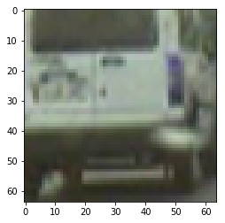  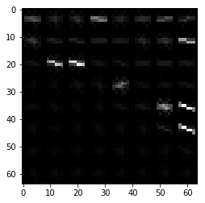

I then explored different color spaces and different `skimage.feature.hog()` parameters (`orientations`, `pixels_per_cell`, and `cells_per_block`).  I grabbed random images from each of the two classes and displayed them to get a feel for what the `skimage.feature.hog()` output looks like. Here is an example using the `YUV` color space and HOG parameters of `orientations=9`, `pixels_per_cell=(8, 8)` and `cells_per_block=(2, 2)`:

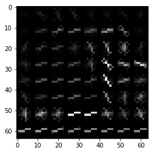  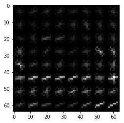

#### 2. Explain how you settled on your final choice of HOG parameters.

I tried various combinations of parameters of the `skimage.feature.hog()` function by changing the values of the `orientations`, `pixels_per_cell`, and `cells_per_block`. I trained a support vector machine(SVM) model using these values for different colorspaces (RGB, YUV and HSV) to understand the differences in accuracies. I got the highest accuracy on the `YUV` color space with hog parameters `orientations=9`, `pixels_per_cell=(8, 8)` and `cells_per_block=(2, 2)`.

#### 3. Describe how (and identify where in your code) you trained a classifier using your selected HOG features (and color features if you used them).

The training of the model is done in the 11th block in the IPython Notebook. 

I extracted the features from the input car and non-car images first. I used the spatial binning, color histogram and hog features to train the model. These gave higher accuracies than with hog features alone. These car and non car features were stacked together as a single stack. I also created the labels corresponding to these, 1's for the car images and 0's for the non-car images.

I split this dataset into training and validation datasets. A `StandardScaler` was used to normalize the input.

```python
# Fit a per-column scaler only on the training data
X_scaler = StandardScaler().fit(X_train)
# Apply the scaler to X_train and X_test
X_train = X_scaler.transform(X_train)
X_test = X_scaler.transform(X_test)
```

I trained a linear SVM initially, using these scaled inputs, and got a test accuracy of around 98.1%. I changed the kernel to `rbf` and got a higher accuracy. I also change the `C` value to 10 and got an accuracy of 99.07%.

### Sliding Window Search

#### 1. Describe how (and identify where in your code) you implemented a sliding window search.  How did you decide what scales to search and how much to overlap windows?

I decided to use the hog sub-sampling window searching method for this project. I chose this since it is more efficient to take hog featuring once and then sub sample it across the windows.

First, the input image is cropped to a region of interest. Then the image is converted to YUV color channel. Then the image is scaled so as to get the appropriate number of pixels in a window. The `scale` paramter was tuned to get an optimal value. The finalized value of `scale` is 1.3.

Then, the first channel of the image is selected. This is done as the classifier is trained with image in a similar method. Then the number of windows that can be accommodated inside the region of interest is calculated. Due to high processing time, the frames were also cut 400 pixels from the left side for the project_video processing.

The hog features for the entire image is now extracted. Each window is then processed. The hog feature for the selected window is sub-sampled and the patch is resized to 64x64. This is done as the training data consisted of 64x64 images. The spatial binning features and the color histogram feauters are extracted from the patch and is combined with the hog features.

This combined vector is now passed to the trained SVM to classify the image. If the image is classified as a car, the vertices of the window is stored. 

This process is repeated for every window. Instead of overlap, the cells per step, that the window has to move, is set.

Here is an image with all the windows including overlapped ones that are used to scan for vehicles in the image.

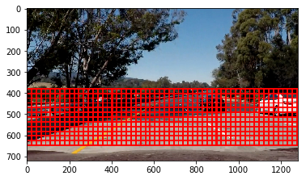

#### 2. Show some examples of test images to demonstrate how your pipeline is working.  What did you do to optimize the performance of your classifier?

Ultimately I searched on a scale of 1.3 using YUV's first channel HOG features plus spatially binned color and histograms of color in the feature vector, which provided a nice result. Initially, I had the three-channel hog features which resulted in a long feature vector which caused slow training time and took long for the prediction process. Reducing the number of channel considered for hog feature extraction resulted in similar accuracies, but much faster training and prediction. 
Here are some example images:

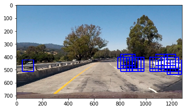
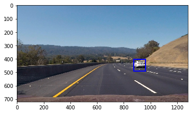
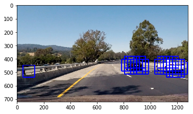
---

### Video Implementation

#### 1. Provide a link to your final video output.  Your pipeline should perform reasonably well on the entire project video (somewhat wobbly or unstable bounding boxes are ok as long as you are identifying the vehicles most of the time with minimal false positives.)
Here's a [link to my video result](project_video_out.mp4)


#### 2. Describe how (and identify where in your code) you implemented some kind of filter for false positives and some method for combining overlapping bounding boxes.

I created a heatmap for each frame of the video and then thresholded that map to identify vehicle positions and remove false positives. This thresholding ensures that only the most hot regions are identified. I then used `scipy.ndimage.measurements.label()` to identify individual blobs in the heatmap. The pixels in these blobs were then converted to ones and was stacked to a `heat_stacked`. This stacked heatmap stores heatmaps for the past 10 frames. This helps to avoid false positive detections in the video.

The sum of the pixels through the depth was taken in the stacked heatmap and a threshold was applied to remove the false positives from the video.

This summed up heatmap was then passed to the `scipy.ndimage.measurements.label()`.
I then assumed each blob in this to correspond to a vehicle.  I constructed bounding boxes to cover the area of each blob detected.  

The examples for this process for 10 frames is present in the second last cell of the IPython Notebook. Here's an example result showing the windows identified, heatmap of frames that frame of the video, the result of `scipy.ndimage.measurements.label()` after the stacked heatmap thresholding and the bounding boxes then overlaid on the frame of the video for 3 frames from the video:

### Here are three frames and their corresponding heatmaps:

##### Frame 1
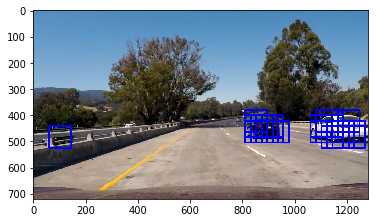
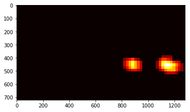
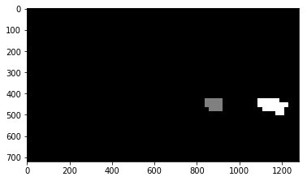
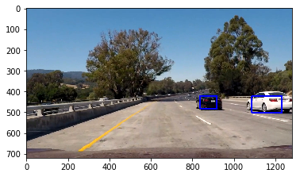

##### Frame 2
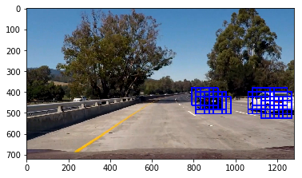
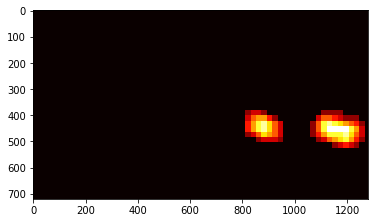

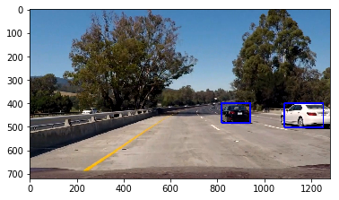

##### Frame 3

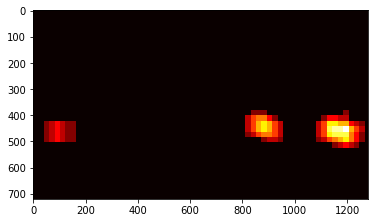
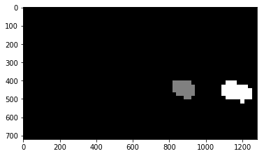
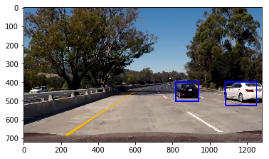
---

### Discussion

#### 1. Briefly discuss any problems / issues you faced in your implementation of this project.  Where will your pipeline likely fail?  What could you do to make it more robust?

I trained the SVM classifier with a `rbf` kernel and a C value of 10. The spatial binning features, histograms of color and hog features taken over the first channel of the YUV color space were combined to be used as the input for the classifier. The data was split into training and test data sets and the SVM classifier was trained on this. The parameters of the SVM were tuned to get higher accuracies.

For detecting vehicles in the video, each frame was to be scanned for them. For this a hog sub-sampling window search technique was used. The hog featues were taken for each frame of the video, a window was defined to go over the frame in a defined region of interest. The sub-sampled hog features were combined with the spatial binning features and the histogram of color features and was fed into the SVM classifer. Based on the classification that a vehicle was found, the windows were a vehicle was found was stored. The `scale` parameter was tuned to identify vehicles in every frame. Also, a heatmap stacking over 10 frames were used to remove false positives from the frames.

The bounding boxes generated by the pipeline are too tight or sometimes small. This is something that can be improved, by giving multiple scales for windows. By this, the bounding boxes can be made more accurate. Also, in some parts of the the video, two cars are detected by the same bounding boxes. This is also an area of improvement. The pipeline might also detect cars from other side of the road, if the divider between the two direction road is small.

